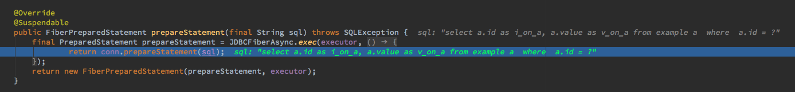

This project is the example of using comsat-jdbc & HikariCP & ScalikeJDBC(with SkinnyFramework).

### products.
- comsat-jdbc is using quasar as the fiber thread model.
 - http://docs.paralleluniverse.co/comsat/
 - https://github.com/puniverse/comsat/tree/master/comsat-jdbc

- HikariCP
 - https://github.com/brettwooldridge/HikariCP

- ScalikeJDBC(with SkinnyFramework).
 - https://github.com/scalikejdbc/scalikejdbc
 - https://github.com/skinny-framework/skinny-framework

### Codes.

- adapter.datasource.rdb.RDBs
```
// Wraping FiberDataSource underlyning to HikariCP Datasource.
val datasource = new HikariDataSource(conf.hikariConfig)
ConnectionPool.add(Symbol(conf.name), new DataSourceConnectionPool(FiberDataSource.wrap(datasource)))
```

### Evidence

Calling with JDBCFiberAsync Executor.

- co.paralleluniverse.fibers.jdbc.FiberConnection
    - 


### Performance evaluation.

WIP